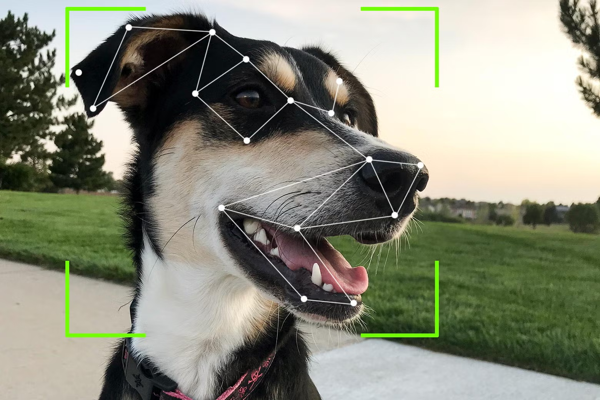

# Dog Breed Classification with Transfer Learning

## Overview

This project focuses on dog breed classification using TensorFlow, employing Convolutional Neural Networks (CNNs) and transfer learning. Despite a challenging dataset comprising only around 400 images per breed, I managed to get the model to a remarkable 88% accuracy on 120 breeds. I learnt a lot through this challenging task of creating an accurate model with very little data. The Stanford Dogs dataset served as the primary data source.

Please note that most of my work was done on google colabs, and then later coded on an IDE. Please see the python notebook for implementation, and data pipelining for my final model.

## Approach

### 1. Custom Model Attempt

Initially, I implemented a custom CNN model with data augmentation, resulting in a modest 15% accuracy.

### 2. Transfer Learning

To enhance performance, I explored transfer learning with pre-trained models. After comparing InceptionV3 and Xception, the Xception model was chosen for its superior results.

### 3. Data Pipeline Optimization

Efficient image resizing and preprocessing were integrated into the data pipeline, initially causing RAM issues. The pipeline was optimized through batching, data saving, and GPU utilization in Google Colab.

## Web Application

A user-friendly web application was developed to allow users to upload dog photos. The images are sent to the API, housing the Xception model, for real-time classification. The frontend is built with TypeScript and React.js, while the backend utilizes Python and Django.

NOTE: Frontend currently under maintenance due to changes in hosting. I will fix this as soon as I can.
